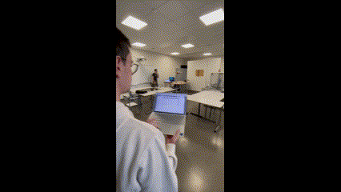

Projet sur 8 mois en école d'ingénieur.
Page de présentation du projet : https://robot-torus.carrd.co

## **Demo**  
Voir les posts vidéos sur LinkedIn ou les extraits ci-dessous :  
  

Making Of before the project is complete :
Démonstration de notre première réussite de contrôle à distance en déclenchant un programme depuis un ordinateur à l'autre bout de la salle : 

Contrôle à distance du robot avec l'interface haptique :
  

Vue de la caméra située sous le phantom où l'aimant situé sur l'embout du Kuka permet de guider le cathéter dans le réseau :

Vidéo contrôle avec VR + résultat dans la réalité :

---
